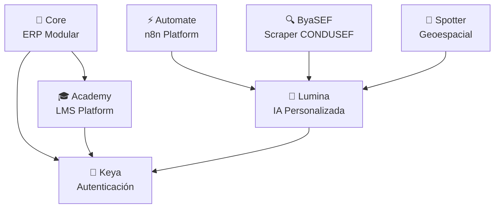

  

  
  

---

## ¿Qué es BYA?

BYA es una compañía de tecnología e innovación enfocada en diseñar soluciones inteligentes que transformen la forma en que las empresas operan, escalan y se comunican. Combinamos ingeniería, diseño y automatización para construir herramientas confiables, accesibles y preparadas para el futuro.

Este repositorio forma parte de nuestra infraestructura tecnológica interna, y ha sido diseñado para mantener la trazabilidad, documentación y evolución constante de nuestros proyectos clave.

 

## ¿Quiénes somos?

BYA es más que una empresa: somos un ecosistema. Nacimos con la visión de crear un entorno tecnológico integral que conecte ideas, personas y procesos a través de la innovación. Operamos bajo una filosofía modular, escalable y centrada en las necesidades reales del usuario.

Nuestros equipos colaboran desde diversas disciplinas como:

- Desarrollo de software
- Automatización de procesos
- Diseño de experiencia de usuario
- Análisis de datos
- Inteligencia artificial

 

## 👥 Nuestro proposito

Diseñamos tecnología para hacer que el trabajo del futuro suceda hoy.

Nos comprometemos a reducir la complejidad operativa de las organizaciones mediante plataformas inteligentes, automatizadas y seguras, que habilitan mejores decisiones, mayor productividad y escalabilidad sostenible.

 

## 🏗️ Áreas de Impacto

### 🔧 Tecnología e Infraestructura
- Arquitectura cloud
- Desarrollo de plataformas empresariales
- APIs privadas y sistemas internos

### 🎨 Diseño e Innovación
- Diseño de productos digitales
- Experiencia de usuario
- Branding y comunicación visual

### 🤖 Automatización e IA
- Automatización de flujos de trabajo
- Web scraping y analítica de datos
- Implementación de asistentes inteligentes

### 📚 Educación y Capacitación
- Desarrollo de entornos de formación profesional
- Contenidos de aprendizaje personalizados

 

## 🌐 Ecosistema de Módulos

 

### 🔹 Core - ERP Modular

Core es la columna vertebral tecnológica de BYA. Integra diversos sistemas como CRM, administración, marketing, atención al cliente, gestión de usuarios y más. Diseñado desde cero para adaptarse a las operaciones del grupo, ofrece flexibilidad, escalabilidad y una interfaz modular que evoluciona junto con las necesidades del negocio.

### 🔹 Academy - LMS Platform

Academy está enfocada en la gestión de contenidos educativos, capacitación interna y formación de aliados externos. Permite estructurar cursos, administrar usuarios, evaluar progresos y generar reportes, todo desde una plataforma accesible y profesional.

### 🔹 ByaSEF - CONDUSEF Scraper

ByaSEF es un framework avanzado de automatización web desarrollado específicamente para la interacción automatizada con sistemas supervisorios financieros. Forma parte del ecosistema Lumina pero también puede utilizarse como API independiente para proyectos externos.

### 🔹 Keya - Sistema de Autenticación

Keya es el núcleo de identidad digital dentro de BYA. Controla el inicio de sesión, permisos, roles, sesiones activas y políticas de seguridad de todos nuestros proyectos, ofreciendo una experiencia de usuario coherente y robusta, con foco en la protección de la información.

### 🔹 Spotter - Análisis Geoespacial

Spotter permite rastrear negocios y puntos de interés por zona, clasificar resultados y almacenar información relevante para procesos de generación de leads, análisis comercial y expansión territorial. Cuenta con una interfaz de consulta intuitiva y adaptable.

### 🔹 Lumina - IA Personalizada

Lumina es nuestro asistente virtual entrenado con herramientas y datos del grupo. Apoya al equipo en tareas administrativas, análisis de datos, respuestas operativas, generación de documentación y más. Es una herramienta viva que aprende y se adapta continuamente.

### 🔹 Automate - Plataforma n8n

Automate permite conectar múltiples servicios, ejecutar tareas programadas, coordinar flujos complejos y reducir la carga operativa de procesos repetitivos. Es el engranaje invisible que mantiene en marcha muchas operaciones del día a día.

 

---

### **Donde transformamos tus ideas en una realidad**

---

*Construido con ❤️ por el equipo BYA*

